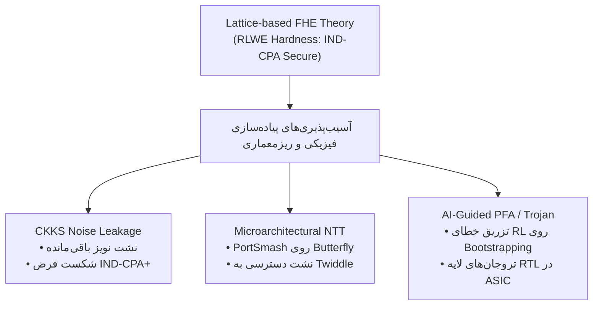

# سند مرجع و دکترین فنی رمزنگاری هم‌ریختی (FHE Master Document)

<aside>
📘

**موضوع:** نظریه ریاضی، ساختارهای چندجمله‌ای، ریزمعماری شتاب‌دهنده‌ها و تهدیدات فیزیکی/رمزشکنی

</aside>

## ۱. مدل ساختاری و تعریف ریاضی (Mathematical Model)

رمزنگاری هم‌ریختی (Homomorphic Encryption - HE) امکانی فراهم می‌سازد تا توابع محاسباتی f مستقیماً روی متن‌های رمزشده (c_i) اجرا شوند، به طوری که رمزگشایی خروجی، معادل اجرای همان تابع روی داده‌های شفاف (Plaintext) باشد:

$$
\text{Dec}\Big(s, \text{Eval}\big(f, \text{Enc}(s, m_1), \dots, \text{Enc}(s, m_n)\big)\Big) = f(m_1, \dots, m_n)
$$

### تعریف جبر مجرد

از دیدگاه جبر مجرد، رمزنگاری هم‌ریختی نگاشتی ساختارخواه (Homomorphism) بین فضای متن آشکار ($(\mathcal{M}, \circ)$) و فضای متن سایفر ($(\mathcal{C}, \star)$) برقرار می‌کند:

$$
\mathcal{D}\Big(\mathcal{E}(m_1) \star \mathcal{E}(m_2)\Big) = m_1 \circ m_2
$$

به زبان ساده‌تر، یک عملگر مشخص در فضای رمزشده ($\star$)، معادل یک عملگر ریاضی مشخص در فضای متن آشکار ($\circ$) عمل می‌کند.

## ۲. رده‌بندی سیستم‌های هم‌ریخت (Taxonomy)

تمام طرح‌های HE بر اساس تنوع عملگرهای مورد پشتیبانی و عمق مدار محاسباتی (Circuit Depth) به چهار رده اصلی تقسیم می‌شوند:

- **هم‌ریختی جزئی (Partially Homomorphic Encryption - PHE):** تنها یک نوع عملگر (فقط جمع یا فقط ضرب) را به تعداد نامحدود پشتیبانی می‌کند:
    - RSA و ElGamal (هم‌ریخت ضربی): $\text{Enc}(m_1) \times \text{Enc}(m_2) = \text{Enc}(m_1 \times m_2)$
    - Paillier (هم‌ریخت جمعی): $\text{Enc}(m_1) \times \text{Enc}(m_2) = \text{Enc}(m_1 + m_2)$
- **هم‌ریختی نسبی (Somewhat Homomorphic Encryption - SWHE):** امکان انجام هر دو عمل جمع و ضرب را فراهم می‌کند، اما عمق مدار محاسباتی محدود است؛ زیرا با انجام ضرب‌های متوالی، میزان نویز ریاضی (Noise) درون متن سایفر رشد کرده و در نهایت رمزگشایی را با خطا مواجه می‌کند.
- **هم‌ریختی سطح‌بندی‌شده (Leveled FHE / LHE):** مدارهایی با عمق پیش‌بینی‌شده و مشخص L را بدون نیاز به فرآیند سنگین بازسازی نویز (Bootstrapping) ارزیابی می‌کند. این مدل برای الگوریتم‌هایی نظیر استنتاج شبکه‌های عصبی (ML Inference) با تعداد لایه‌های ثابت بسیار کاربردی است.
- **هم‌ریختی کامل (Fully Homomorphic Encryption - FHE):** با کشف کریگ جنتری (Craig Gentry) در سال ۲۰۰۹ بر پایه نظریه مشبکه‌ها (Lattice-based Cryptography)، محاسبه مدارهای عمومی منطقی (شامل گیت‌های AND و XOR یا NAND) با عمق نامحدود ممکن شد.

## ۳. مسئله نویز، ساختار RLWE و مکانیزم Bootstrapping

تمام سیستم‌های FHE مدرن بر پایه مسائل سخت مشبکه مانند Learning With Errors (LWE) یا نسخه حلقه‌ای آن Ring-LWE (RLWE) طراحی شده‌اند.

در سیستم‌های مبتنی بر RLWE، یک متن سایفر به صورت برداری از چندجمله‌ای‌ها درون حلقه $R_q = \mathbb{Z}_q[X]/(X^N + 1)$ تعریف می‌شود:

$$
c = (a, b) \quad \text{where} \quad b = a \cdot s + \Delta \cdot m + e \pmod q
$$

که در آن s کلید محرمانه، $\Delta$ فاکتور مقیاس، m پیام و e مقدار نویز (Noise) است.

### رشد نویز در محاسبات

- **جمع دو متن سایفر:** نویز به صورت خطی رشد می‌کند ($e_{\text{new}} \approx e_1 + e_2$).
- **ضرب دو متن سایفر:** نویز به صورت ضربی/نمایی رشد می‌کند ($e_{\text{new}} \approx e_1 \cdot e_2$).
- اگر نویز e از آستانه مشخصی ($\frac{q}{2}$) تجاوز کند، پیام m برای همیشه تخریب می‌شود.

### راهکار جنتری: Bootstrapping

برای جلوگیری از فروپاشی داده، فرآیند Bootstrapping اجرا می‌شود. در این فرآیند، الگوریتم رمزگشایی خودِ سیستم به صورت یک مدار هم‌ریخت اجرا می‌شود. تراشه/سیستم، کلید رمزگشایی رمزشده $\text{Enc}(s)$ را دریافت کرده و الگوریتم رمزگشایی را روی متن سایفرِ پرنویز c اعمال می‌کند. خروجی این فرآیند، یک متن سایفر جدید c' از همان پیام m است، اما نویز آن به مقدار اولیه بازنشانی شده است.

## ۴. طیف‌شناسی طرح‌های سه‌گانه مدرن (The Big Three)

امروزه FHE به سه طرح اصلی تقسیم می‌شود که هرکدام برای نوع خاصی از محاسبات بهینه‌سازی شده‌اند:

| ویژگی / طرح | BGV / BFV | CKKS | TFHE / FHEW |
| --- | --- | --- | --- |
| نوع داده هدف | اعداد صحیح دقیق ($\mathbb{Z}_p$) | اعداد ممیز شناور / تقریبی ($\mathbb{C} / \mathbb{R}$) | بیت‌های منفرد / گیت‌های منطقی Boolean |
| روش پردازش | SIMD Batching (بسته‌بندی در Slotها) | SIMD Batching برای بردارها | ارزیابی گیت‌به‌گیت (via PBS) |
| سرعت Bootstrapping | کند (چند ثانیه تا چند دقیقه) | کند | بسیار سریع (چند میلی‌ثانیه‌ای) |
| کاربرد اصلی | پایگاه‌داده، آمار دقیق، رأی‌گیری | یادگیری ماشین (AI/ML)، پردازش سیگنال | درخت‌های تصمیم، مقایسه، منطق شرطی |

<aside>
🔑

**نکته کلیدی در CKKS:** طرح CKKS به جای مقدار دقیق، مفهوم محاسبات تقریبی را وارد FHE کرد. در CKKS، نویز جزئی از خطای گردکردن (Rounding Error) داده‌های ممیز شناور در نظر گرفته می‌شود. این ویژگی، CKKS را به استاندارد طلایی Privacy-Preserving Machine Learning (PPML) تبدیل کرده است.

</aside>

## ۵. تاریک‌خانه رمزشکنی FHE؛ نقاط کور و حملات پیشرفته (Dark Corners)

### ۱.۵. آسیب‌پذیری نشت نویز در CKKS (Approximate Bootstrapping Side-Channel)

در طرح CKKS، فرآیند Bootstrapping به صورت «تقریبی» اجرا می‌شود (نه دقیق).

- **بردارهای حمله (IND-CPA+ & Side-Channel):** مهاجم با تزریق متون سایفر انتخابی (Chosen Plaintext) و تحلیل خروجی‌های تقریبی، توزیع نویز شناور (Floating Noise Distribution) را مدل‌سازی می‌کند. همچنین با پایش سیگنال‌های الکترومغناطیسی (EM) یا توان مصرفی (Power) در حین اجراهای متوالی Bootstrapping، تفاوت‌های میکروسکوپی نویز باقی‌مانده (Residual Noise) را اندازه‌گیری می‌کند.
- **نتیجه:** از آنجا که نویز residual در هر اجرای Bootstrapping حاوی امضای مستقیم کلید محرمانه (s) است، بیت‌های کلید لو می‌روند. لایبرری‌های واقعی (OpenFHE, SEAL, HElib) به طور معمول حفاظت کافی در برابر این نشت فیزیکی/آماری ندارند.

### ۲.۵. حملات گیت‌به‌گیت در TFHE (Gate-by-Gate Fault Injection)

نقطه قوت TFHE، «ارزیابی گیت‌به‌گیت» توسط Programmable Bootstrapping (PBS) است.

- **بردارهای حمله:** مهاجم با تزریق خطای موضعی (Glitch ولتاژ یا پالس لیزر) روی یک گیت منطقی خاص، خروجی آن گیت را تحت کنترل درمی‌آورد.
- **نتیجه:** با دستکاری جدول صحت (Truth Table) درون LUT رمزشده‌ی یک گیت، منطق داخلی مدار از درون می‌شکند و کلید یا داده‌های شفاف با حداقل سربار استخراج می‌شوند. دفاع در برابر این حمله نیازمند اعمال Redundancy سنگین است.

### ۳.۵. خطای پایدار در Bootstrapping متوالی (PFA on FHE Accelerators)

شتاب‌دهنده‌های سخت‌افزاری FHE به شدت متکی بر اجراهای پیوسته و چندباره فرآیند Bootstrapping هستند.

- **بردارهای حمله (PFA):** مهاجم یک خطای دائمی (Stuck-at Fault) روی فلیپ‌فلاپ‌های مربوط به واحدهای NTT یا Key-Switching ایجاد می‌کند.
- **نتیجه:** چون Bootstrapping بارها تکرار می‌شود، مهاجم مجموعه‌ای از متن‌های رمزشده معیوب اما همبسته (Correlated Faulty Ciphertexts) جمع‌آوری کرده و با تحلیل جبری-آماری، کلید را بازسازی می‌کند.

### ۴.۵. ترکیبات نوظهور رمزشکنی

- **ترکیب Fault Injection با کاهش بعد مشبکه (Dimension Reduction):** تزریق خطا باعث کاهش رتبه ماتریس‌های مشبکه شده و حل مسئله LWE را برای الگوریتم‌های reduction آسان‌تر می‌سازد.
- **حملات الگومحور (Template Attacks) با شبکه‌های عصبی:** حتی طرح‌های Masking مرتبه بالا در FHE نیز توسط مدل‌های یادگیری عمیق که روی پروفایل‌های نویز آموزش دیده‌اند، قابل رمزگشایی هستند.

## ۶. گلوگاه‌های ریزمعماری و تهدیدات سخت‌افزاری

### ۱.۶. نشت ریزمعماری در واحدهای پروانه NTT (NTT Butterfly Side-Channels)

عملیات Number Theoretic Transform (NTT) برای ضرب سریع چندجمله‌ای‌های با درجه بالا ($N = 2^{13}$ تا $2^{16}$) قلب تپنده FHE است.

- **بردار نفوذ:** مهاجم از طریق حملات رقابت پورت (PortSmash در SMT) یا اشغال خطوط کش (Cache Occupancy Attack) روی عملیات Butterfly، زمان اجرا و الگوی دسترسی به جدول ضریب‌های توئیدل (Twiddle Factors) را اندازه‌گیری می‌کند.
- **شکست کدهای Constant-Time:** فرضیه کدهای زمان‌ثابت در سطح اسمبلی، یک انتزاع شکسته است؛ ریزمعماری سخت‌افزار مستقل از نرم‌افزار، الگوی کلید را نشت می‌دهد.

### ۲.۶. تزریق خطای هدایت‌شده با هوش مصنوعی (DeepFI / AI-Guided Fault Injection)

استفاده از الگوریتم‌های یادگیری تقویتی (RL) برای پیدا کردن کورترین روزنه‌های فیزیکی شتاب‌دهنده.

- **مکانیزم:** عامل RL پاسخ‌های آنالوگ/دیجیتال تراشه به تزریق خطا را به عنوان سیگنال پاداش (Reward) دریافت کرده و در مقیاس زیر نانوثانیه، سه متغیر «لحظه دقیق گلیچ»، «شکل موج» و «مختصات مکانی (X-Y)» را بهینه‌سازی می‌کند تا دقیقا حلقه Bootstrapping را هدف قرار دهد.

### ۳.۶. تروجان سخت‌افزاری در زنجیره تأمین (Hardware Trojan in FHE ASICs)

در تراشه‌های اختصاصی عظیم FHE (نظیر پروژه‌های DARPA DPRIVE)، امکان قرار دادن تروجان در لایه RTL وجود دارد.

- **سناریو:** تروجان مینیاتوری (در حد ۲ گیت) در زمان اجراهای خاص (مانند فاز Key-Switching)، بیت‌های کلید را از طریق سیگنال‌های جانبی ضعیف (EM/Power) نشت می‌دهد. این نوع حمله در تمام تست‌های پس از تولید فرار کرده و غیرقابل تشخیص است.

## ۷. مقایسه تطبیقی FHE با فناوری‌های هم‌جوار

| معیار | FHE (Homomorphic) | MPC (Multi-Party Computation) | ZKP (Zero-Knowledge Proofs) |
| --- | --- | --- | --- |
| هدف اصلی | محاسبه بدون دسترسی به داده | محاسبه مشترک بدون اشتراک داده | اثبات صحّت محاسبات بدون افشای داده |
| پهنای باند شبکه | بسیار پایین (تنها ارسال/دریافت سایفر) | بسیار بالا (ارتباطات دائم بین گره‌ها) | پایین |
| بار محاسباتی | بسیار بالا (سنگینی روی پردازنده) | پایین تا متوسط | بسیار بالا برای اثبات‌کننده (Prover) |
| مدل اعتماد | نیازمند هیچ گره مورد اعتمادی نیست | نیازمند عدم تبانی گره‌ها (Non-collusion) | نیازمند Cryptographic Assumptions |

## ۸. جمع‌بندی استراتژیک

<aside>
🎯

**دکترین نهایی:** امنیت ریاضی مشبکه‌ها (Lattice Hardness) ضامن امنیت فیزیکی سیستم‌های FHE روی سیلیکون نیست.

</aside>

<aside>
⚠️

**پاشنه آشیل اصلی:** فرآیند Bootstrapping و واحدهای محاسباتی NTT نقاط تمرکز اصلی حملات هستند؛ جایی که نشت نویز، خطاهای پایدار (PFA) و کانال‌های جانبی ریزمعماری، فرضیات تئوریک را به چالش می‌کشند.

</aside>